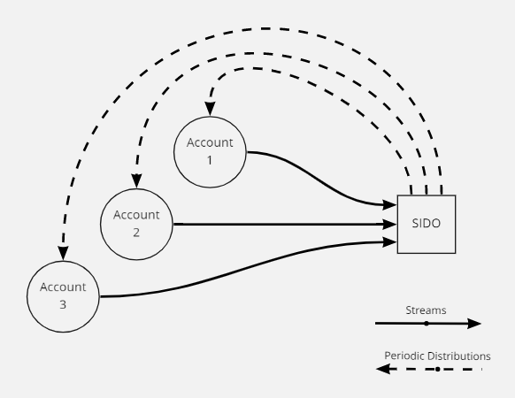
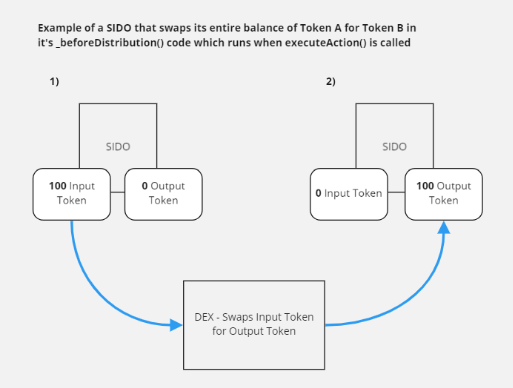
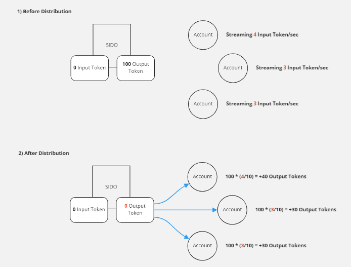
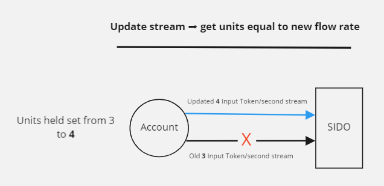

# Stream-In ➡ Distribute-Out (SIDO) Example

Howdy dev 🤠! 

Welcome to the Stream-In/Distribute-Out (SIDO) Example, one of the most potent Superfluid Super App design patterns known to mankind. Let's talk about what it is and does and then break down how it's used.

Suggested Requisites:
- Read through the Super Agreements Overview in our docs so you understand the terminology we'll be talking about (especially the IDA part)
- Try out the Budget NFT Example and Token Spreader Example. This is pretty much the most advanced example we have, so trying out some these easy Superfluid Solidity projects first could help.

# What Does SIDO Do?

SIDO gives us a way to accept streams of a certain input Super Token from any number of accounts and distribute (with the IDA, not CFA!) another output Super Token back to those accounts in proportion to the size of their streams.

The SIDO model is the best and most scalable model to have many incoming token streams get exchanged for another token and have that token distributed back to the many streaming accounts in the appropriate amounts. 

The SIDO Example is meant to be a framework. It's designed so you can customize what happens between the streaming in of the input token and the distributing out of the output token.

# Use Cases

The SIDO's most powerful use case is for "real-time investing". Think dollar-cost averaging with streams into tokens, LP positions, staking positions, etc.

A SIDO can be made such that, you can stream a wrapped Super Token stablecoin (like USDCx or DAIx) into it and begin receiving periodic distributions of a certain Super Token asset (say, WETHx or WBTCx) in return at an interval of your choosing (which you could set with a keeper). Instead of just a plain outbound asset like WETHx, you could even take it a step further and make it a Wrapper Super Token of a tokenized yield-bearing asset, like Lido Staked ETH. There are a ton of possibilities.

A SIDO is literally the best and most flexible model to do on-chain dollar-cost averaging. 

# Visualizing + Explaining Functionality

## Functionality

1. When accounts start streaming Token A into the SIDO, they are given distribution units for an IDA Index inside the contract for outbound Token B equal to their flow rate.

2. Token A is accumulating in the SIDO as the streams continue 🚰

3. At any time, `executeAction()` can be called which does the following:

    - Run `_beforeDistribution()`, an internal function where you can program some custom logic. Perhaps you want to convert all the accumulated Token A into Token B with a DEX. Perhaps you want to send all the Token A to some treasury and mint some Token B out of thin air. Do whatever you please.

    

    - The SIDO then takes the entire balance of Token B in the contract and distributes back out to every account at once (in the viz below, the 10 comes from the # of total outstanding units which is 3 + 3 + 4 = 10)

    

    - NOTE: This where the **dollar-cost averaging potential** of the SIDO is. If in `_beforeDistribution` you are swapping all accumulated Token A to Token B with a DEX and you're calling `executeAction()` on fixed intervals (with a keeper) to send Token B back to the streaming accounts, you've got yourself a dollar-cost averaging dApp!

4. At any time, an account may create, update, or delete a stream to the SIDO. With the callbacks the SIDO has prepared for all three, it will react by...

    - Having the account's distribution units updated to equal its new flow rate.

    

    - Run the `executeActionInCallback()` code which does the same as what we saw in 4.)

    - *If the account is deleting a stream*, SIDO tries to run `executeActionInCallback()` but there may be a chance that the kung fu you put in there will cause a reversion. That's a problem because if you revert in your deletion callback, your Super App goes to [jail](https://docs.superfluid.finance/superfluid/developers/developer-guides/super-apps/super-app#super-app-rules-jail-system) which is very bad. So we try/catch it. In the catch, we just refund the the account the total amount of Token A it has streamed into the contract since the last `executeAction()`.

# Why not Stream-In/Stream-Out (SISO)? 

SISO works if there is no expected change in the output ratio. So for example, if it's always going to be for every 1 DAIx streamed, you get 0.5 TOKENx, then all the contract has to do is react to an incoming stream of DAIx by sending back a stream of TOKENx at half of the DAIx flow rate. You're only affecting *one* stream.

But, what if that rate (1 DAIx to X-amount of TOKENx) fluctuates? Then you have a problem, because you'd have to iterate through and modify every. single. one. of those outbound TOKENx streams when that exchange rate changes. Not scalable! You'd solve this with the IDA by sending TOKENx back to DAIx streamers in separate all-at-once distributions in proportion to the size of their DAIx streams.

So bottom line, if you're trying to do fixed input rate of Token A to variable output rate of Token B, then SIDO's your guy!